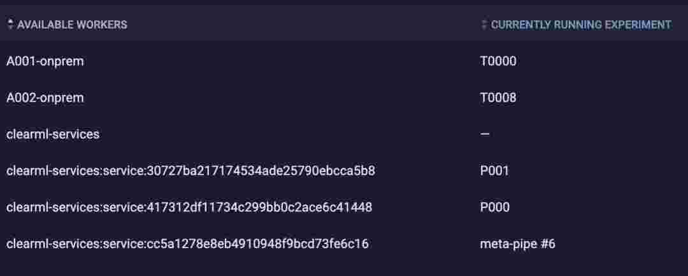

# Examples

The examples herein are provided to demonstrate some of the trickier parts of using ClearML, namely:
- how to pass UI parameters in pipelines to underlying tasks
- how to create pipelines that can be scaled (horizontally), which will be useful for testing remote worker scaling.
- covers a practical example of common operations (map/reduce), demonstrating most of the ClearML Task + Pipeline workflow features:
  - Metrics
  - Models
  - Artifacts
  - Pipelines
  - Monitoring
- how to leverage the ClearML API to scale tasks and aggregate results from many experiments

## run it all

```bash
make examples
```

## detailed breakdown

### `tasks/demo-task.py`
Base task that represents our atomic unit of work. Showcases many of the ClearML features.

### `pipes/pipe_add_step.py`
Uses the `demo-task.py`-created experiment (referenced by project + name) to launch a pipeline that passes arguments from the UI into copies of the task definition.

### `pipes/meta_pipe.py`
Similarly, uses the definition of the `pipe_add_step.py`-created pipeline (also just a task) to launch multiple pipelines, all on the `services` queue.

This pipeline of pipelines is designed to stress-test the system and demonstrate some of its features.

Notice that we allocated up to 5 simultaneous processes on the `services` queue.
If we allocate pipeline controllers to this queue, but have the tasks go to `default`, we can see the intended usage of `services`: launching controller / monitoring processes that are long-running but low-resource (e.g., enqueuing other tasks, updating pipeline visuals, etc).

Using `meta_pipe.py` with its defaults, we launch two pipelines at once (think of it like an A/B test), with different parameters in each. 

The meta-pipeline itself first gets a container allocated to it by the `services` agent (running in `docker` mode. 
This task then launches two pipelines into the `services` queue as well. 
Each one will get its own container thanks to being allocated to the services queue.
Therefore, we see three containers running ephemeral agent processes for us, along with the tasks in the `default` queue (worker names `A001-onprem` and `A002-onprem`):



Since we have up to five processes (configurable in `compose.yml`), we could run up to four comparisons in this default state.

## Credentialing

Settings > Workspace in ClearML's web UI.

Then generate new app credentials. 
Copy / paste the section it gives you into `~/clearml.conf`

Once completed, you are ready to run `python <example-name>.py` and various other clearml-related commands.

